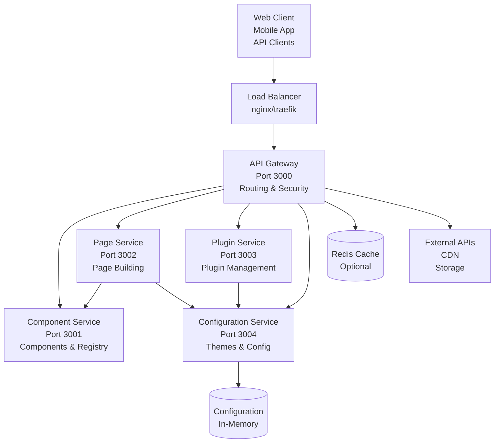
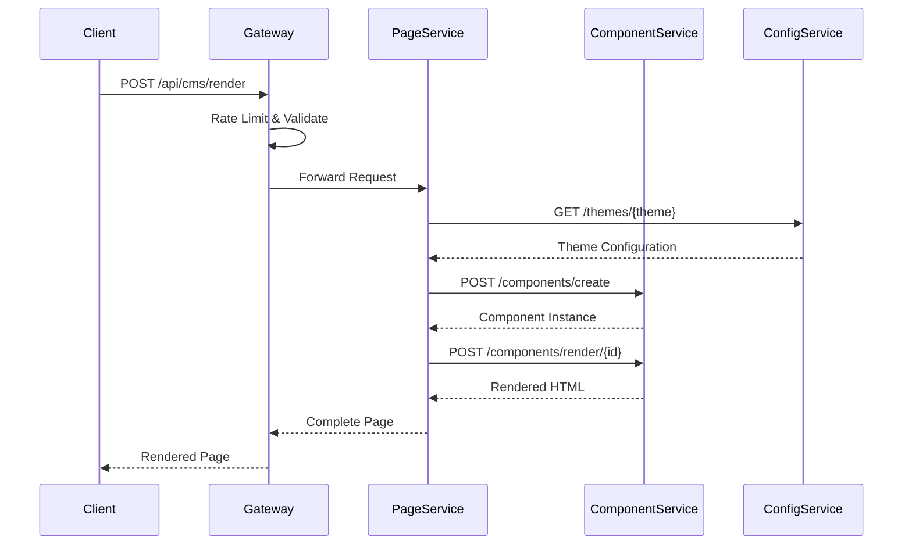

# Universal CMS - Microservices Architecture

##  **Architecture Overview**

Each service is independently deployable, scalable, and follows single responsibility principle.

### **System Architecture Diagram**



### **Service Communication Flow**



##  **Services Overview**

### 1. **API Gateway** (Port 3000)
- **Purpose**: Entry point for all requests, routing, and load balancing
- **Responsibilities**:
  - Request routing to appropriate services
  - Rate limiting and security (CORS, Helmet)
  - Request/response validation
  - Service health monitoring
- **Technology**: Express.js, Rate Limiting, Security Headers

### 2. **Component Service** (Port 3001)
- **Purpose**: Component registration, management, and rendering
- **Responsibilities**:
  - Dynamic component registration
  - Component instance management
  - Component rendering engine
  - Component validation
- **Technology**: Express.js, Dynamic Component Loading

### 3. **Page Service** (Port 3002)
- **Purpose**: Page building, composition, and rendering
- **Responsibilities**:
  - Page building from components
  - Page rendering orchestration
  - Zone-based component management
  - Theme integration
- **Technology**: Express.js, Component Communication

### 4. **Plugin Service** (Port 3003)
- **Purpose**: Plugin lifecycle management and extensibility
- **Responsibilities**:
  - Plugin registration and activation
  - Plugin dependency management
  - Plugin lifecycle (initialize/activate/deactivate/dispose)
  - Runtime plugin loading
- **Technology**: Express.js, Dynamic Plugin Loading

### 5. **Configuration Service** (Port 3004)
- **Purpose**: Configuration management and theming
- **Responsibilities**:
  - Theme management (create, update, delete)
  - Configuration storage and retrieval
  - Default theme provisioning
  - Runtime configuration updates
- **Technology**: Express.js, In-memory Storage

##  **Deployment Options**

### Docker Compose (Development)
```bash
# Start all services
docker-compose up -d

# View logs
docker-compose logs -f

# Scale specific services
docker-compose up -d --scale component-service=3

# Stop all services
docker-compose down
```

### Kubernetes (Production)
```bash
# Create namespace
kubectl apply -f k8s/namespace.yaml

# Deploy all services
kubectl apply -f k8s/

# Check deployment status
kubectl get pods -n universal-cms

# View services
kubectl get services -n universal-cms

# Access API Gateway
minikube service api-gateway --url -n universal-cms
```

### Individual Docker Images
```bash
# Build all services
npm run docker:build:all

# Build individual service
cd services/component-service
npm run docker:build

# Run individual service
docker run -p 3001:3001 universal-cms/component-service
```

##  **Service Communication**

### Internal Service Communication
- All services communicate via HTTP/REST APIs
- Services use environment variables for service discovery
- Circuit breaker pattern implemented for resilience
- Request/response format standardized

### External API Endpoints
All external requests go through the API Gateway:

```
/api/components/*  → Component Service
/api/pages/*      → Page Service
/api/plugins/*     → Plugin Service
/api/themes/*      → Configuration Service
/api/cms/*        → Orchestrated (Page + Component)
```

##  **Load Balancing & Scaling**

### Horizontal Scaling
```yaml
# Kubernetes - Scale component service
kubectl scale deployment/component-service --replicas=5

# Docker Compose - Scale page service
docker-compose up -d --scale page-service=3
```

### Service Load Balancing
- **API Gateway**: LoadBalancer (external access)
- **Internal Services**: ClusterIP (internal access)
- **Health Checks**: Liveness and readiness probes

##  **Security Features**

### API Gateway Security
- CORS configuration
- Helmet.js security headers
- Rate limiting (1000 requests/15min per IP)
- Request/response validation

### Container Security
- Non-root user execution
- Minimal attack surface
- Health check isolation
- Resource limits and requests

##  **Monitoring & Health Checks**

### Health Check Endpoints
All services expose `/health` endpoint:
```json
{
  "status": "healthy",
  "service": "component-service",
  "timestamp": "2024-01-20T10:30:00.000Z",
  "components": 15
}
```

### Service Status Monitoring
- API Gateway provides `/services` endpoint for overall system health
- Individual service health status tracking
- Automatic restart on failure

##  **Development Workflow**

### Local Development
```bash
# Start development environment
docker-compose -f docker-compose.yml --profile development up

# Hot reload enabled
npm run dev:gateway
npm run dev:component-service
npm run dev:page-service
```

### Service Updates
```bash
# Rebuild and restart service
cd services/component-service
npm run docker:build
docker-compose restart component-service

# Rolling updates (Kubernetes)
kubectl set image deployment/component-service universal-cms/component-service:v2.0
```

##  **Configuration**

### Environment Variables
- `COMPONENT_SERVICE_URL`: Component service endpoint
- `PAGE_SERVICE_URL`: Page service endpoint
- `PLUGIN_SERVICE_URL`: Plugin service endpoint
- `CONFIG_SERVICE_URL`: Configuration service endpoint

### Service-Specific Configuration
Each service can be configured independently via:
- Environment variables
- Configuration files
- Runtime configuration API

##  **Performance Considerations**

### Service Resources
- **API Gateway**: 2 replicas, 512Mi memory limit
- **Component Service**: 2 replicas, 512Mi memory limit
- **Page Service**: 2 replicas, 512Mi memory limit
- **Plugin Service**: 1 replica, 512Mi memory limit
- **Config Service**: 1 replica, 256Mi memory limit

### Optimization Strategies
- Connection pooling for inter-service communication
- Caching at API Gateway layer
- Resource limits prevent resource exhaustion
- Health checks ensure service availability


##  **Production Deployment**

### Prerequisites
- Docker 20.0+
- Kubernetes 1.20+ (for production)
- 2GB+ RAM minimum
- Container runtime (Docker/containerd)

### Deployment Steps
1. Build all Docker images
2. Deploy to Kubernetes cluster
3. Configure load balancer
4. Set up monitoring and logging
5. Configure CI/CD pipeline
6. Test inter-service communication

### CI/CD Integration
```yaml
# GitHub Actions example
jobs:
  deploy:
    runs-on: ubuntu-latest
    steps:
      - name: Build images
        run: |
          docker build -t universal-cms/api-gateway ./services/api-gateway
          docker build -t universal-cms/component-service ./services/component-service
      - name: Deploy to Kubernetes
        run: |
          kubectl apply -f k8s/
      - name: Verify deployment
        run: |
          kubectl rollout status deployment/api-gateway
```

##  **API Documentation**

### Core Endpoints

#### CMS API (via API Gateway)
```bash
# Create and render page
POST /api/cms/render
{
  "title": "My Page",
  "theme": "default",
  "components": [
    {
      "id": "header",
      "type": "HeaderComponent",
      "configuration": { "title": "Welcome" }
    }
  ]
}
```

#### Component Management
```bash
# Register component
POST /api/components/register
{
  "name": "CustomComponent",
  "componentCode": "class CustomComponent { ... }",
  "metadata": { "category": "custom" }
}

# List components
GET /api/components/list

# Create component instance
POST /api/components/create
{
  "name": "CustomComponent",
  "configuration": { "text": "Hello World" }
}
```

#### Page Management
```bash
# Create page
POST /api/pages/create
{
  "title": "My Page",
  "theme": "custom",
  "components": [...]
}

# Render page
POST /api/pages/render/{id}
{
  "context": { "services": {} }
}

# List pages
GET /api/pages
```

##  **Troubleshooting**

### Common Issues

#### Service Communication Failures
```bash
# Check service health
curl http://localhost:3000/services

# Check individual service logs
docker logs api-gateway
docker logs component-service
```

#### Port Conflicts
```bash
# Check port usage
netstat -tulpn | grep :300
# Update port in docker-compose.yml
# Use different port mapping
```

#### Memory Issues
```bash
# Check resource usage
docker stats
# Increase memory limits in docker-compose.yml
```

#### Build Failures
```bash
# Clear Docker cache
docker system prune -a
# Rebuild without cache
docker-compose build --no-cache
```